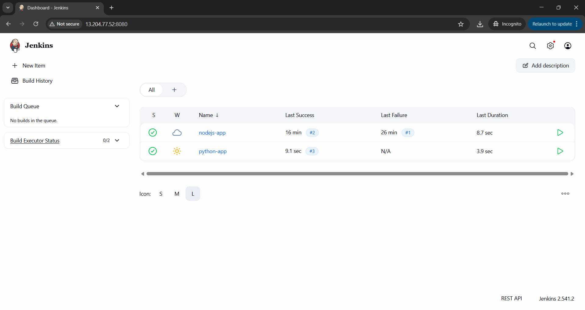
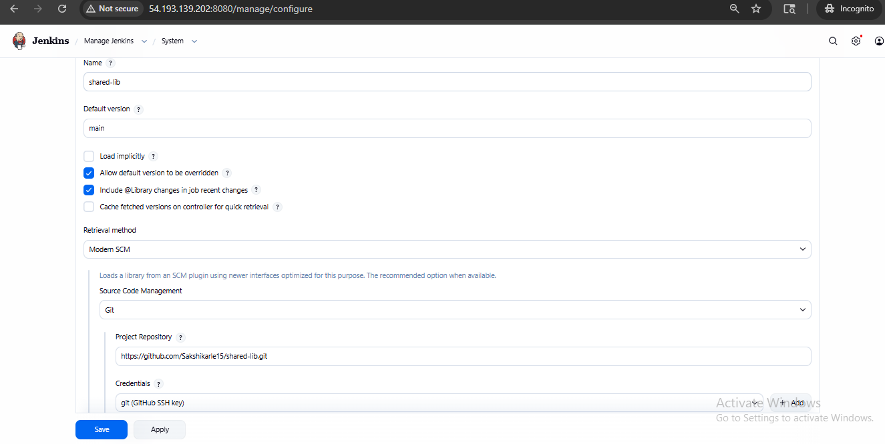
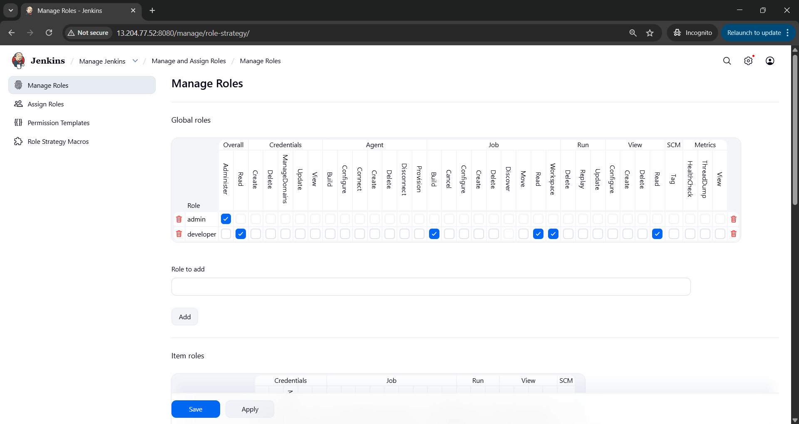

# Centralized-CI-CD-Platform-Setup-using-Jenkins

## Project Overview

This project demonstrates the design and implementation of a Centralized CI/CD Platform using Jenkins.
It enables multiple applications to use a standardized pipeline through a shared library, eliminating duplication and improving consistency.

## Problem Statement
In many organizations:

* Each team manages its own Jenkins server 
* Pipelines are inconsistent
* Security is misconfigured 

 __Solution__:
Build a centralized Jenkins platform where multiple applications use reusable pipeline logic

## Architecture :

    ┌─────────────────────────────────────────────────────────────┐
    │                     GitHub Repositories                      │
    │  ┌──────────────┐  ┌──────────────┐  ┌──────────────┐      │
    │  │ Shared Lib   │  │ Node.js App  │  │ Python App   │      │
    │  └──────────────┘  └──────────────┘  └──────────────┘      │
    └─────────────────────────────────────────────────────────────┘
                                │
                                ▼
    ┌─────────────────────────────────────────────────────────────┐
    │                    Jenkins Master (EC2)                      │
    │  ┌────────────────────────────────────────────────────┐     │
    │  │  • Shared Library Configuration                    │     │
    │  │  • Credential Management                           │     │
    │  │  • Role-Based Access Control                       │     │
    │  │  • Multi-Branch Pipeline Jobs                      │     │
    │  └────────────────────────────────────────────────────┘     │
    └─────────────────────────────────────────────────────────────┘
                                │
                                ▼
    ┌─────────────────────────────────────────────────────────────┐
    │                    Jenkins Agents                            │
    │  ┌──────────────┐  ┌──────────────┐  ┌──────────────┐      │
    │  │ Static Agent │  │ Dynamic Agent│  │ Docker Agent │      │
    │  └──────────────┘  └──────────────┘  └──────────────┘      │
    └─────────────────────────────────────────────────────────────┘
                                │
                                ▼
    ┌─────────────────────────────────────────────────────────────┐
    │                  Standardized Pipeline Stages                │
    │     Build  →  Test  →  Security Scan  →  Deploy             │
    └─────────────────────────────────────────────────────────────┘
    
                                 
## Key Features

### 1. Centralized Jenkins Infrastructure
   
* Deployed on AWS EC2 instance
* Configured with static and dynamic agents
* Centralized credential management
* Scalable architecture

### 2. Shared Pipeline Library
* Reusable pipeline components
* Standardized stages: Build → Test → Scan → Deploy
* Version-controlled pipeline logic
* Easy to maintain and update

### 3. Multi-Application Support
* Onboarded multiple applications (Node.js, Python)
* Single line Jenkinsfile: @Library('shared-lib') _ cicdPipeline()
* Consistent behavior across all projects
* Technology-agnostic approach

### 4. Role-Based Access Control
* __Developers:__ View and build jobs
* __Admins:__ Full configuration access
* Secure credential isolation
* Audit trail for all actions

## Techologies Used

| Technology | Purpose |
|------------|--------|
| Jenkins | CI/CD orchestration platform |
| AWS EC2 | Cloud infrastructure hosting |
| Docker | Containerization for builds |
| GitHub | Source code management |
| Groovy | Shared library scripting |
| Node.js | Sample application 1 |
| Python | Sample application 2 |

## Project Structure

    Centralized-CI-CD-Platform-using-Jenkins/
    │
    ├── img/        # Screenshots and diagrams
    │├── jenkins-dashboard.png
    │   ├── manage roles.png
    │   ├── stages of pipelines.png
    │   └── shared lib.png
    │
    ├── nodejs-demo-app/ # Sample Node.js app
    │   ├── jenkinsfile # Pipeline configuration 
    │   ├── package.json
    │   └── README.md
    │
    ├── python-demo-app/  # Sample Python app
    │   ├── jenkinsfile   # Pipeline configuration
    │   └── README.md
    │
    └── README.md     # Project documentation   

__Note__ : The Jenkins Shared Library is maintained in a separate repository and configured in Jenkins Global Settings.

## Setup Instruction 

### Prerequisites
* AWS Account with EC2 access
* GitHub account
* Basic knowledge of Jenkins and CI/CD concepts

## Step 1: Jenkins installation on EC2

    # Launch EC2 instance (Ubuntu 22.04 LTS)
    # Instance Type: t2.medium or higher
    # Security Group: Allow ports 8080 (Jenkins), 22 (SSH)

    # SSH into EC2 instance
    ssh -i your-key.pem ubuntu@<ec2-public-ip>

    # Install Java
    sudo apt update
    sudo apt install openjdk-11-jdk -y

    # Install Jenkins
    curl -fsSL https://pkg.jenkins.io/debian-stable/jenkins.io-2023.key | sudo tee \
    /usr/share/keyrings/jenkins-keyring.asc > /dev/null
    echo deb [signed-by=/usr/share/keyrings/jenkins-keyring.asc] \
    https://pkg.jenkins.io/debian-stable binary/ | sudo tee \
    /etc/apt/sources.list.d/jenkins.list > /dev/null
    sudo apt update
    sudo apt install jenkins -y

    # Start Jenkins
    sudo systemctl start jenkins
    sudo systemctl enable jenkins

    # Get initial admin password
    sudo cat /var/lib/jenkins/secrets/initialAdminPassword

## Step 2: Configure Jenkins

1. Access Jenkins at http://<ec2-public-ip>:8080
2. Install suggested plugins
3. Create admin user
4. Install additional plugins:
    * Pipeline
    * Git
    * Docker Pipeline
    * Role-based Authorization Strategy

## Step 3: Setup shared library
1. Navigate to Manage Jenkins → Configure System
2. Scroll to Global Pipeline Libraries
3. Add library
   
    * Name: shared-lib
    * Default version: main
    * Retrieval method: Modern SCM
    * Source Code Management: Git
    * Project Repository:
   
          <your-shared-library-repo-url>

## Step 4: Configure Agents

Static Agent:

    # On agent machine
    java -jar agent.jar -jnlpUrl http://<jenkins-url>/computer/<agent-name>/slave-agent.jnlp
Dynamic Agent (Docker):

* Install Docker Pipeline plugin
* Configure Docker cloud in Jenkins settings

## Step 5: Setup Credentials

* Navigate to Manage Jenkins → *
* Manage Credentials
* Add credentials:
     * GitHub token
     * Docker Hub credentials
     * AWS credentials (if needed)
## Step 6: Create Pipeline job
* New Item → Pipeline or Multibranch Pipeline
* Configure SCM to point to application repository
* Jenkins will automatically detect Jenkinsfile
* Pipeline will use shared library automatically

## Shared Library Implementation
    jenkins-shared-library/
    ├── vars/
    │   └── cicdPipeline.groovy  # Main pipeline 
    |                               definition
    ├── src/
    │   └── org/company/
    │       ├── Build.groovy
    │       ├── Test.groovy
    │       ├── Scan.groovy
    │       └── Deploy.groovy
    └── resources/
        └── scripts/

## Sample Shared Library Code (vars/cicdPipeline.groovy)

    def call() {
      pipeline {
        agent any

        stages {

            stage('Checkout') {
                steps {
                    checkout scm
                }
            }

            stage('Build') {
                steps {
                    script {
                        echo "Building application..."

                        if (fileExists('package.json')) {
                            sh 'npm install'
                        } 
                        else if (fileExists('requirements.txt')) {
                            sh 'pip install -r requirements.txt'
                        } 
                        else {
                            echo "No recognized build file found"
                        }
                    }
                }
            }

            stage('Test') {
                steps {
                    script {
                        echo "Running tests..."

                        if (fileExists('package.json')) {
                            sh 'npm test || true'
                        } 
                        else if (fileExists('requirements.txt')) {
                            sh 'pytest || true'
                        } 
                        else {
                            echo "No test framework detected"
                        }
                    }
                }
            }

            stage('Security Scan') {
                steps {
                    echo "Running security scan..."
                    // Example: sh 'trivy fs .'
                }
            }

            stage('Deploy') {
                steps {
                    echo "Deploying application..."
                    // Add deployment commands here
                }
            }
        }

        post {
            success {
                echo "Pipeline completed successfully!"
            }
            failure {
                echo "Pipeline failed!"
            }
            always {
                echo "Pipeline execution finished"
            }
        }
    } 
    }
## Sample Application 

### 1. Node.js demo app
jenkinsfile:

    @Library('shared-lib') _

    cicdPipeline()
That's it! The shared library handles all pipeline logic.

### 2. Python demo app

jenkinsfile:

    @Library('shared-lib') _

    cicdPipeline()
Same simple configuration, consistent behavior.

## Access Control 

### Role Configuration

| Role      | Permissions                                                             |
| --------- | ----------------------------------------------------------------------- |
| Admin     | Full access to Jenkins configuration, job creation, and system settings |
| Developer | View jobs, trigger builds, view console output                          |
| Viewer    | Read-only access to job status and build history                        |

## Setup RBAC
1. Install Role-based Authorization Strategy plugin
2. Navigate to Manage Jenkins → Manage and Assign Roles
3. Create roles with specific permissions
4. Assign users to roles

## Screenshots:

### Jenkins Dashboard

### Stages of Pipeline

### Shared Library Repository

### Role Management

## Deliverables
* __Jenkins Shared Library Repository:__ Reusable pipeline components
* __Sample Application Pipelines:__ Node.js and Python demo apps
* __Multi-Project Pipeline Screenshots:__ Visual proof of implementation
* __Comprehensive Documentation:__ Setup guide and architecture explanation
* __Role-Based Access Control:__ Security implementation
* __Centralized Infrastructure:__ Single Jenkins instance on EC2

## Learning Outcomes:

* Designed and implemented enterprise-grade CI/CD platform
* Created reusable Jenkins Shared Libraries
* Configured role-based access control for security
* Deployed and managed Jenkins on AWS EC2
* Standardized pipeline processes across multiple applications
* Reduced infrastructure costs through centralization

## Future Enhancements

* Implement Jenkins Configuration as Code (JCasC)
* Add automated testing for shared library
* Integrate with Kubernetes for dynamic agent provisioning
* Implement advanced security scanning (SonarQube, Trivy)
* Add monitoring and alerting (Prometheus, Grafana)
* Create self-service portal for team onboarding
## Acknowledgement
* Jenkins community for detailed documentation
* Acknowledgment of cloud infrastructure services that enabled reliable deployment and scalability
* Open-source ecosystem providing tools, plugins, and continuous innovation